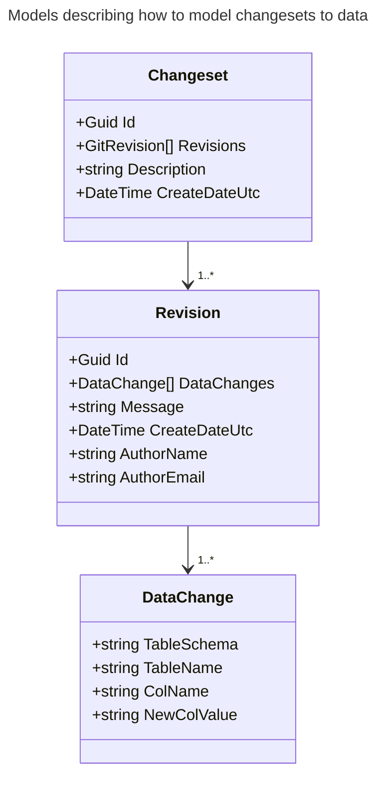

# Design notes

Thoughts and design notes will be kept here.

## Describing changesets

### Describing changes to data

### Describing changes to DB objects

TODO ...

## Getting a diff between a table present schema/data, and to-be

TODO...

## Tracking multiple revisions to a changeset over time

TODO...